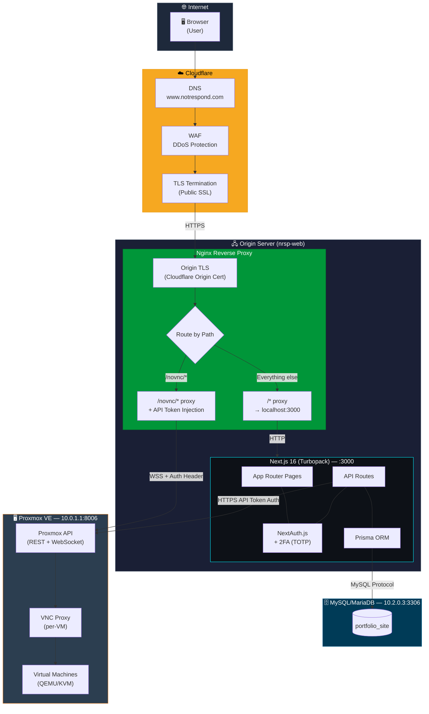
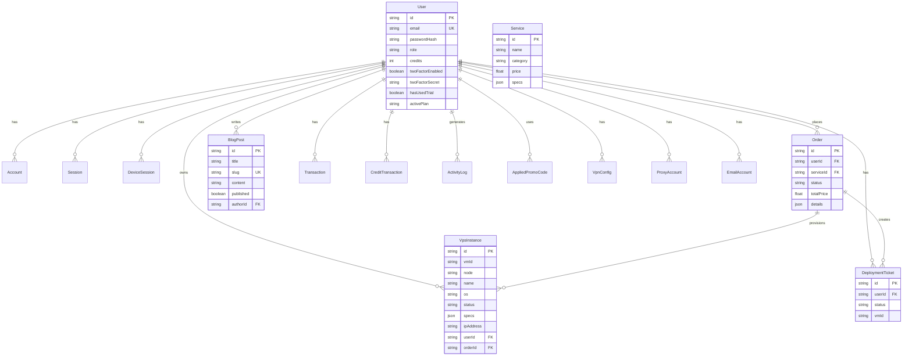

# Notrespond.com — System Architecture

## Network & Infrastructure Flow



## Request Flow Details

### 🌐 Regular Page Request
```
Browser → Cloudflare (WAF + TLS) → Nginx (/:443) → Next.js (:3000) → Prisma → MySQL
```

### 🖥️ noVNC Console (WebSocket)
```
Browser → Cloudflare → Nginx (/novnc/) → Proxmox VE (:8006)
   │                                         │
   │  ┌─ 1. POST /api/proxmox/vms/{id}/console/novnc ──→ Next.js ──→ Proxmox (get ticket)
   │  │                                                                    │
   │  │  ┌─────────── ticket + password + wsUrl (path only) ←──────────────┘
   │  │  │
   │  └──┤  2. wss://www.notrespond.com/novnc/...?vncticket=... 
   │     │     ↓
   │     │  Nginx injects Authorization header → Proxmox authenticates
   │     │     ↓
   │     └─ 3. RFB handshake (password = generated password) → VM console stream
   │
   └── noVNC renders <canvas> in browser
```

### 🔐 VM Management (API)
```
Browser → Next.js API Route → Proxmox REST API (API Token Auth)
                │
                ├── POST /start    → Start VM
                ├── POST /stop     → Stop VM
                ├── POST /reboot   → Restart VM
                ├── POST /destroy  → Delete VM
                ├── PATCH /display → Switch VGA (noVNC/SPICE)
                └── POST /deploy   → Create new VM
```

## Database Schema (MySQL)



## Technology Stack

| Layer | Technology |
|-------|-----------|
| **CDN / WAF** | Cloudflare (DNS, DDoS, TLS, WebSocket proxy) |
| **Reverse Proxy** | Nginx (path routing, noVNC WebSocket proxy, API token injection) |
| **Frontend** | Next.js 16, React 19, Turbopack |
| **Auth** | NextAuth.js v5, TOTP 2FA |
| **ORM** | Prisma (MySQL) |
| **Database** | MariaDB/MySQL |
| **Hypervisor** | Proxmox VE (QEMU/KVM) |
| **Console** | noVNC (pre-bundled via esbuild IIFE) |
| **Styling** | CSS + Tailwind |

## Network Topology

```
┌─────────────────────────────────────────────────┐
│  Private Network                                │
│                                                 │
│  ┌──────────────┐    ┌──────────────────────┐   │
│  │ nrsp-web     │    │ Proxmox (Timox-1)    │   │
│  │ 10.2.0.2     │───▶│ 10.0.1.1:8006        │   │
│  │              │    │                      │   │
│  │ • Nginx      │    │ • VM 111 (Ubuntu)    │   │
│  │ • Next.js    │    │ • VM xxx ...         │   │
│  │ • Prisma     │    │                      │   │
│  └──────┬───────┘    └──────────────────────┘   │
│         │                                       │
│  ┌──────▼───────┐                               │
│  │ MariaDB      │                               │
│  │ 10.2.0.3:3306│                               │
│  └──────────────┘                               │
└─────────────────────────────────────────────────┘
          │
          │ Cloudflare Tunnel / Direct
          ▼
    ☁️ Cloudflare → 🌐 Internet → 🖥️ Browser
```
