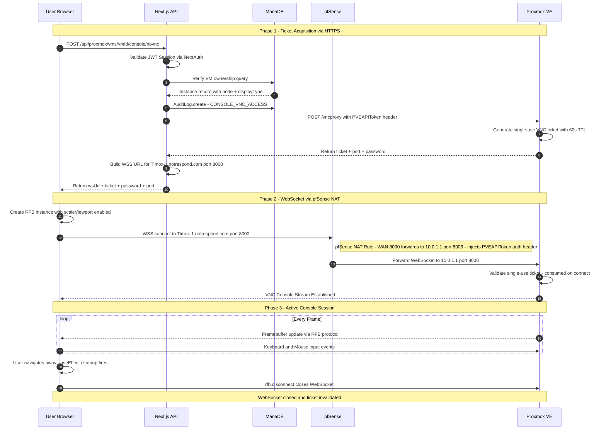
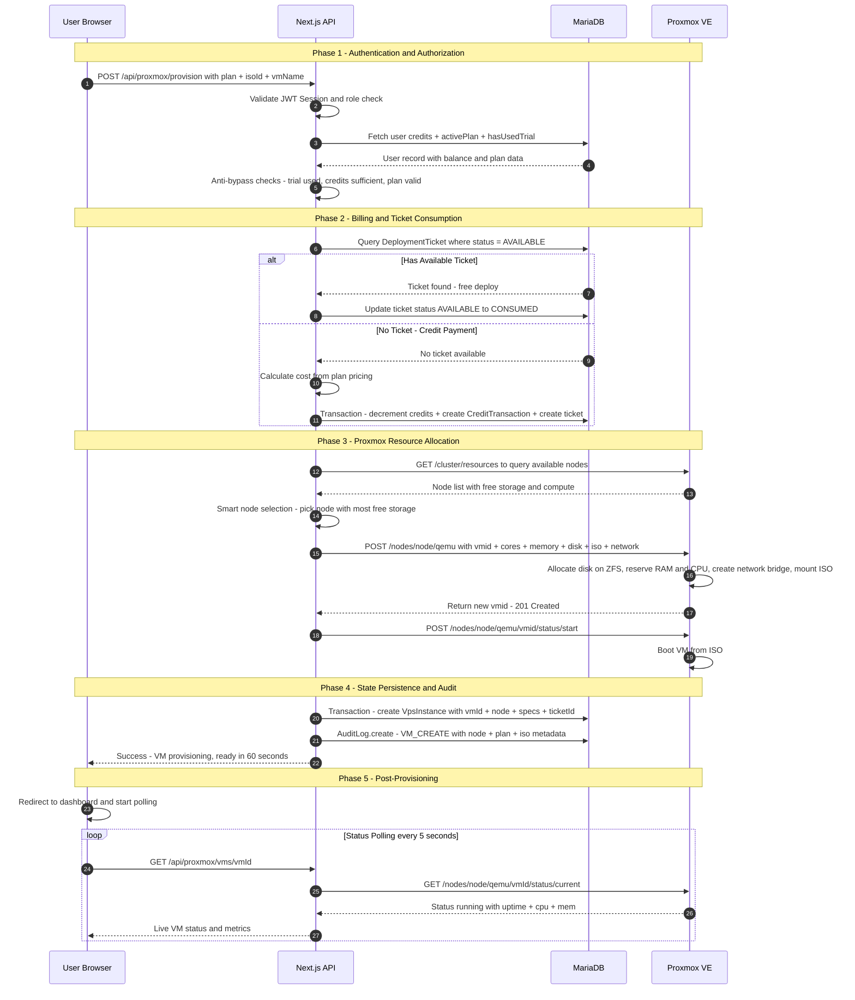
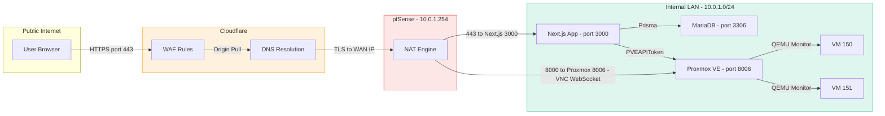

# Operational Principles — Cloud VM Renting Platform

> Infrastructure-level architecture and operational workflows showing how security policies, identity management, and resource provisioning are enforced across network boundaries.

---

## System Architecture — Policy-Based Access Control Model

### Architecture Mapping to Security Standards

| Security Concept | Platform Component | Standard |
|---|---|---|
| **Policy Enforcement Point (PEP)** | pfSense Firewall — NAT, port forwarding, ACL | ISO 27001 A.13 |
| **Policy Decision Point (PDP)** | Next.js API — NextAuth, RBAC, Rate Limiter | ISO 27001 A.9 |
| **Identity Repository** | MariaDB — User, DeviceSession, 2FA secrets | ISO 27001 A.9.2 |
| **Policy Repository** | MariaDB — AuditLog (immutable), Roles | ISO 27001 A.12.4 |
| **Resource Registry** | MariaDB — VpsInstance, DeploymentTicket | ISO 27017 CLD.9 |
| **Provisioning Services** | Proxmox VE API — VM lifecycle management | ISO 27001 A.12.1 |
| **Audit Logger** | AuditLog model — append-only, 3yr retention | ISO 27001 A.12.4 |

---

## Scenario A: Secure noVNC Console Access

> **Focus:** Network translation, single-use ticket handshake, and WebSocket path through pfSense NAT.

---

## Scenario B: VM Provisioning

> **Focus:** Database consistency, credit billing, Proxmox resource allocation, and the deployment ticket system.

---

## Network Translation Map

---

## Security Boundaries Summary

| Boundary | Enforcer | Mechanism | ISO Control |
|----------|----------|-----------|-------------|
| **Browser to Cloudflare** | Cloudflare WAF | TLS 1.3, rate limiting, DDoS mitigation | A.13.1.1 |
| **Cloudflare to pfSense** | Origin Certificate | Cloudflare Full Strict SSL mode | A.13.1.2 |
| **pfSense to Internal** | NAT + ACL | Port forwarding only on 443 and 8000 | A.13.1.3 |
| **API to Proxmox** | PVEAPIToken | Bearer token injected by pfSense | A.9.4.2 |
| **API to Database** | Prisma + TLS | Connection pooling, parameterized queries | A.14.2.5 |
| **VNC Ticket** | Proxmox | Single-use, 60s TTL, consumed on connect | A.9.4.1 |
| **User Deletion** | onDelete Restrict | Audit logs cannot be destroyed with user | A.12.4.2 |
| **Audit Trail** | AuditLog ISO 27001 | Immutable, append-only, 3-year retention | A.12.4.1 |
